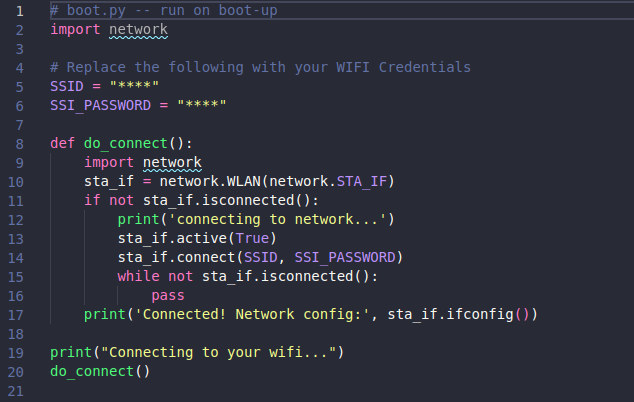
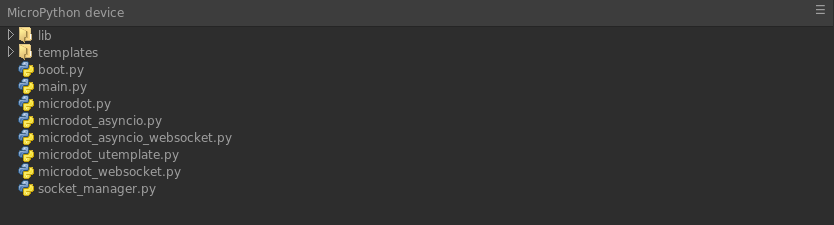
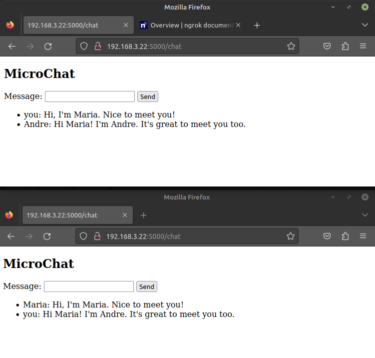

# MicroChat: ESP32 - MicroPython - Microdot

MicroChat is a project developed using MicroPython and Microdot to create a simple chat service. It offers a web-based chat interface that allows users to communicate in real-time.

- [MicroPython](https://micropython.org/)
- [Microdot](https://microdot.readthedocs.io/en/latest/api.html)

### Replace Credentials

### Copy

### Run ...:5000/

